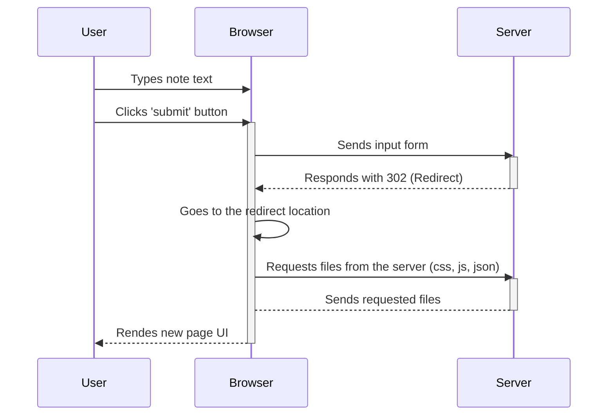

# Task #0.4

1. User types text
2. User clicks the submit button
3. Browser sends user input to the server
4. Server responds with 302 (Redirect)
5. Browser goes to provided link and reloads the UI
6. Browser requests files from the server (css, js, json)
7. Server sends the requested files to the browser
8. Browser renders the new UI to the user

