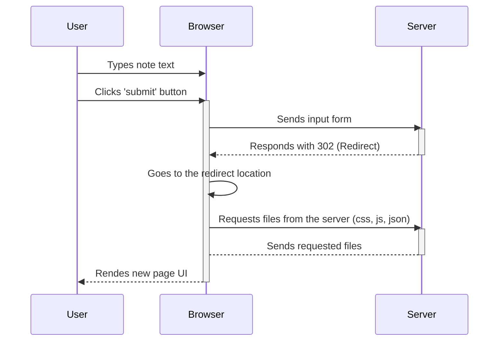
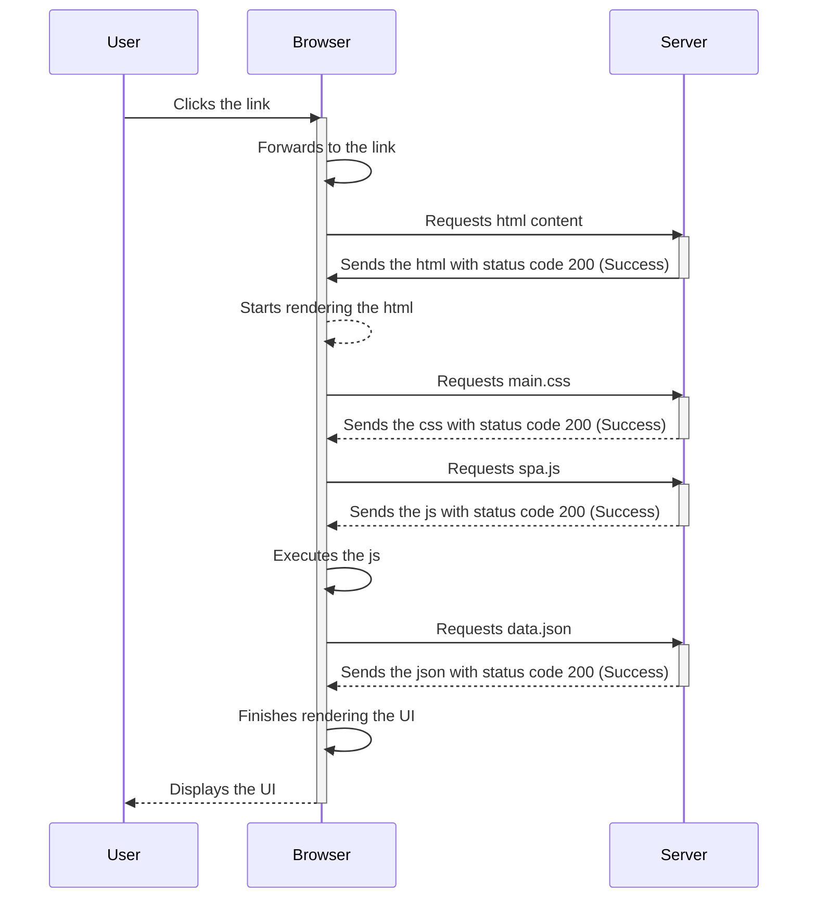
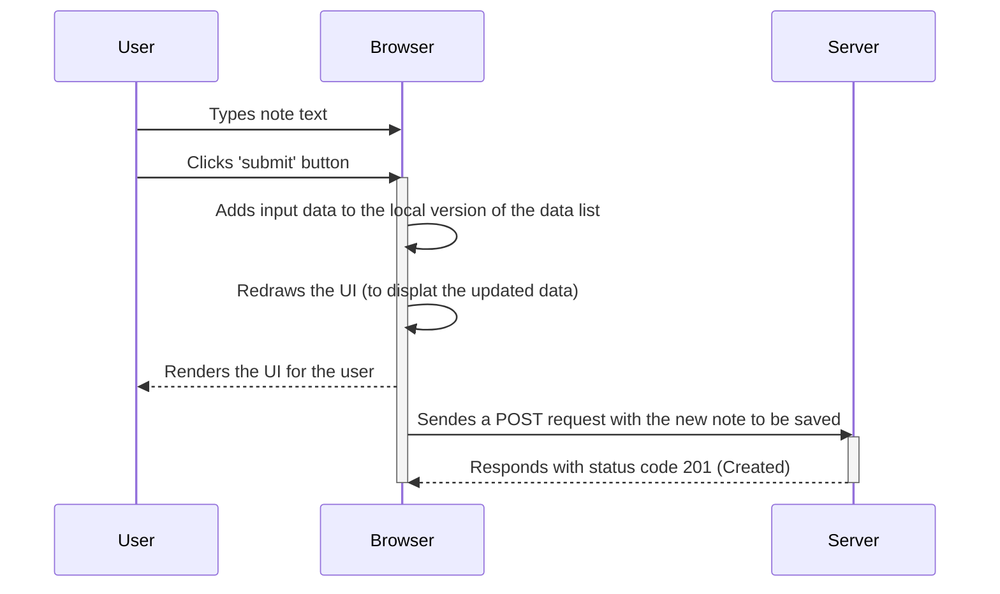

# Task #0.4

1. User types text
2. User clicks the submit button
3. Browser sends user input to the server
4. Server responds with 302 (Redirect)
5. Browser goes to provided link and reloads the UI
6. Browser requests files from the server (css, js, json)
7. Server sends the requested files to the browser
8. Browser renders the new UI to the user

# Task #0.5

1. User clicks the link
2. Bowser forwards to the link
3. Browser requests html content from the server
4. Server sends the html to the browser with status code 200 (Success)
5. Browser starts rendering the html
6. Browser requests main.css from the server
7. Server sends the css to the browser with status code 200 (Success)
8. Browser requests spa.js file from the server
9. Server sends the js to the browser with status code 200 (Success)
10. Browser executes the js
11. Browser requests data.json from the server
12. Server sends the json to the browser with status code 200 (Success)
13. Browser finished rendering the UI
14. Browser displays the UI to the user.

# Task #0.6

1. User types input
2. User presses submit button
3. Browser adds input to the local version of the data list
4. Browser redraws the list
5. Browser sends the new note to the server
6. Server responds with 201 (Created)

